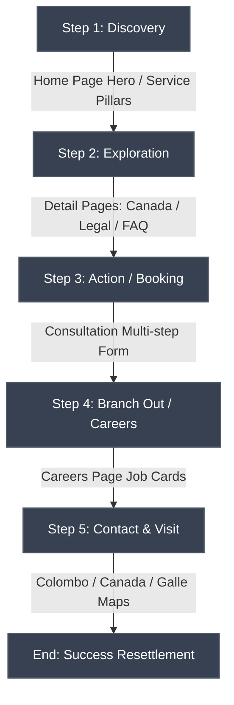

# Storyboard & Color Guide

This document outlines the user experience journey flow (Storyboard) and details the typographic and color systems (Color Guide) implemented for the **Apex-Trust-Ardent** website.

---

## Part 1: Storyboard (User Experience Journey)

The storyboard outlines how a prospective client interacts with the website from initial discovery to booking a consultation or applying for a career.

### Step 1: Discovery (Home Page Landing)
*   **User Action:** A user lands on the Home Page and views the high-resolution Hero Carousel representing a smooth immigration pathway.
*   **Interface Response:** 
    *   The user interacts with the floating **Dark/Light Mode Toggle** in the bottom right corner to set their preference.
    *   The user scrolls to explore the **3 Core Service Pillars** (Canada, Other Countries, Legal) and reads the clear summaries.

### Step 2: Exploration (Detail Pages)
*   **User Action:** Intrigued by Canadian pathways, the user clicks "Explore More" on the Canada card or uses the navbar dropdown.
*   **Interface Response:** 
    *   The user is navigated to [canada.html](file:///d:/documents/immigration%20site/pages/canada.html) where they find structured Express Entry checklists.
    *   The user clicks through the **Canada FAQ Accordion** to find information on points and processing.

### Step 3: Action (Consultation Booking)
*   **User Action:** Ready to move forward, the user clicks "Get A Quote" or navigates to the Consultation page.
*   **Interface Response:** 
    *   The user fills out the booking form, choosing their immigration stream and scheduling details.
    *   A smooth validation popup confirms receipt of their appointment.

### Step 4: Careers & Team Fit
*   **User Action:** A qualified professional visits the Career page seeking to join the consultancy.
*   **Interface Response:** 
    *   The user reads through the **Immigration Counsellor**, **Legal Associate**, and **Client Services** cards.
    *   Clicking "Apply Now" pre-fills their position input and scrolls them to the form.

### Step 5: Connection & Maps
*   **User Action:** The user needs to deliver physical documents to their local office and checks contact details.
*   **Interface Response:** 
    *   The user accesses local phone lines and uses the embedded **Google Maps iframes** to navigate directly to the Colombo Kollupitiya, Canada, or Galle office.

---

## Part 2: Color Guide (Design System)

The color guide outlines the design tokens used across the Light and Dark themes to maintain professional contrast and brand identity.

### 1. Light Mode System (Corporate Professional)
Optimized for high readability under standard office lighting, utilizing deep corporate slate and crisp white backgrounds:

| Token Name | Hex Code | Visual Sample | Usage Area |
| :--- | :--- | :--- | :--- |
| **Primary (Brand Blue)** | `#003a66` | `██████` | Navigation links, main headings, primary button borders. |
| **Secondary (Crimson Accent)** | `#ff6b8b` | `██████` | Highlight text, hover states, active indicators. |
| **Light Background** | `#F9FAFB` | `██████` | Main body backgrounds, alternate sections. |
| **Neutral White** | `#FFFFFF` | `██████` | Card items, headers, active dropdown panels. |
| **Text Dark (Primary)** | `#1F2937` | `██████` | Main headings and paragraph texts. |
| **Text Muted** | `#6B7280` | `██████` | Captions, metadata, placeholders. |

---

### 3. Dark Mode System (Premium Sleek)
A curated dark theme designed to reduce eye strain in low-light environments, using glowing secondary highlights and deep navy layers:

| Token Name | Hex Code | Visual Sample | Usage Area |
| :--- | :--- | :--- | :--- |
| **Dark Background** | `#0b1220` | `██████` | Global page body canvas fill. |
| **Surface (Card Dark)** | `#0f1a33` | `██████` | Cards, navbar headers, modal popups. |
| **Surface Accent (Hover)** | `#102545` | `██████` | Hover states, active inputs, inner badges. |
| **Text Light (Primary)** | `#e2e8f0` | `██████` | Headings, active links, primary dark typography. |
| **Accent Glow** | `#ff6b8b` | `██████` | Interactive state indicators, button outlines. |
| **Anchor/Link Blue** | `#93c5fd` | `██████` | Hyperlink states in paragraph blocks. |

---

### 3. Contrast & Accessibility (WCAG 2.1 Conformance)
*   **Text Contrast:** All primary text layers on white background (Light mode) and deep navy backgrounds (Dark mode) maintain a contrast ratio exceeding **4.5:1** (meeting **WCAG AA** standards).
*   **Large Headings:** Display text headings maintain a contrast ratio exceeding **3.0:1** for readable hierarchy.
*   **Form Inputs:** Inactive inputs use a `#D1D5DB` outline in light mode and `#102545` fill in dark mode, ensuring distinct boundaries for input interaction.
